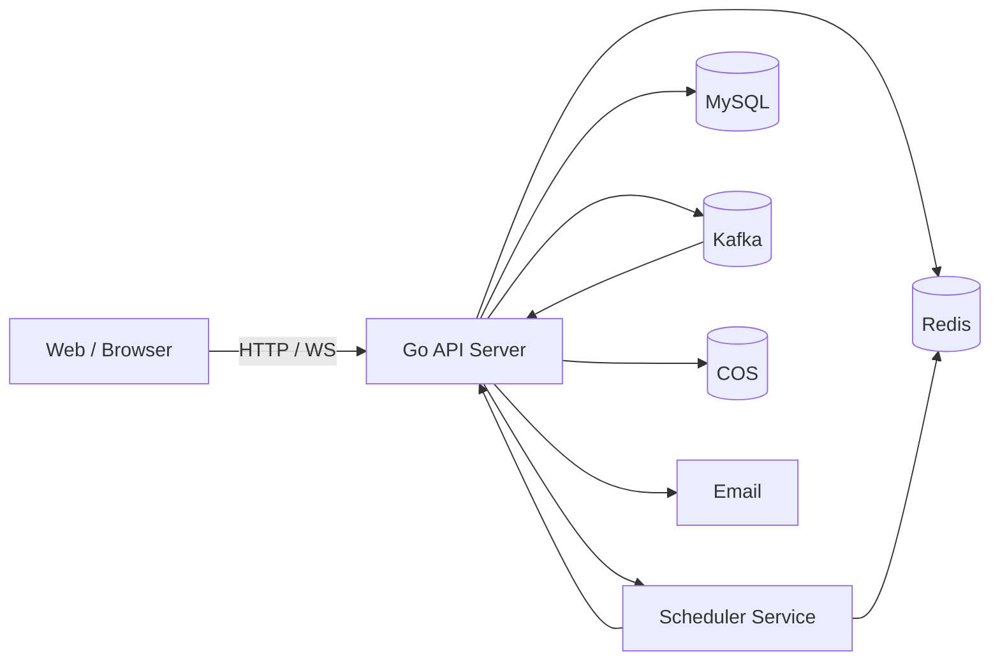
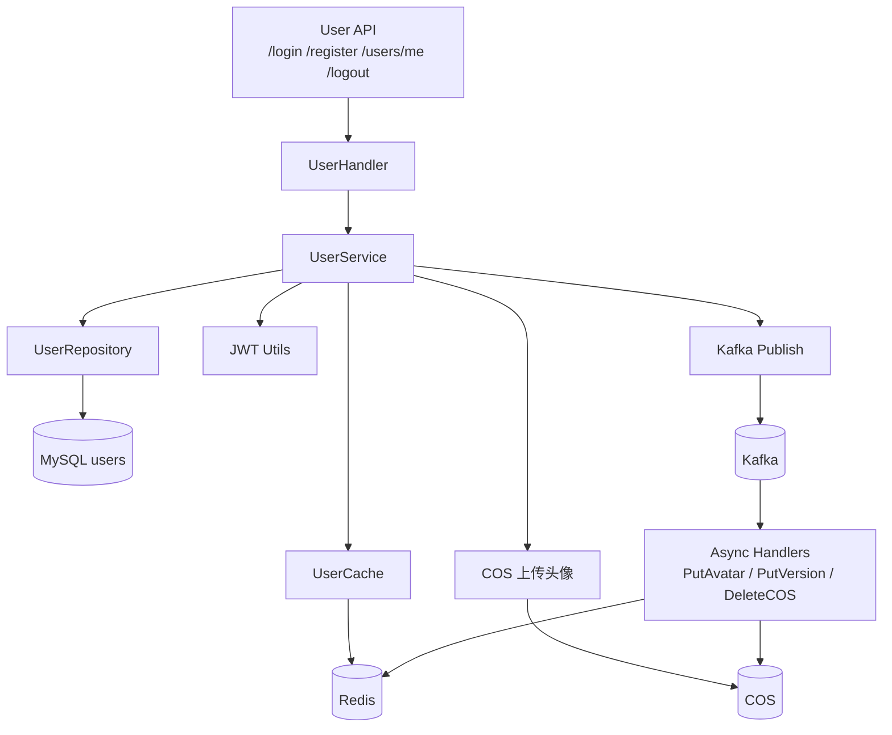
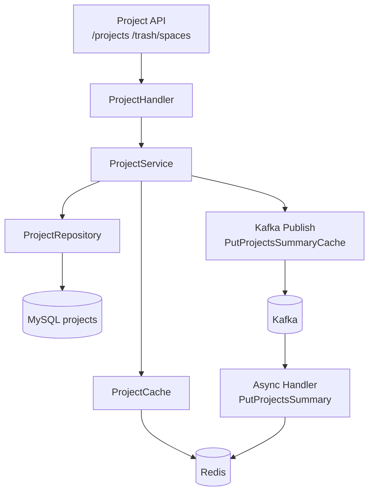
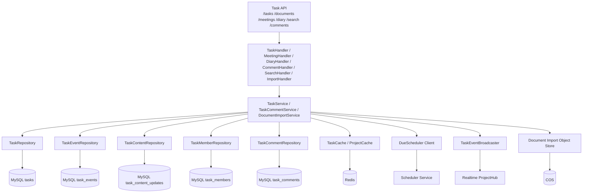
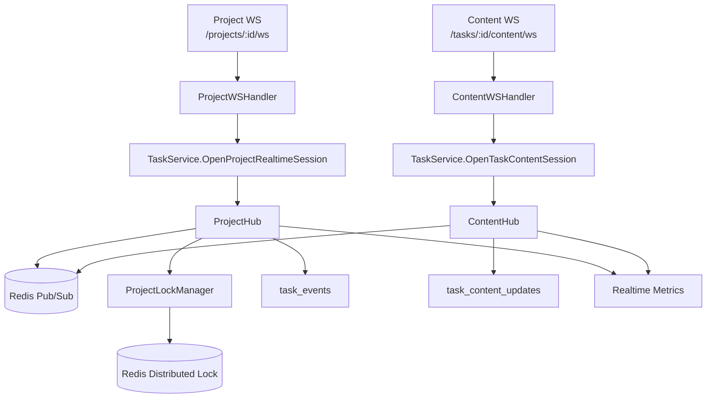
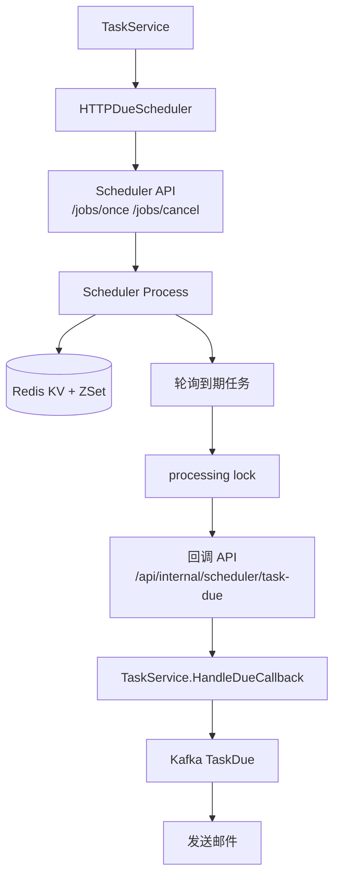

# 后端架构梳理（模块精简版）

面向快速阅读，只保留 5 个核心模块总图：

- User
- Project
- Task
- Realtime
- Scheduler

完整细节版见 [backend-architecture.md](E:\todolist\docs\backend-architecture.md)。

## 1. 总览

## 2. User 模块

职责：

- 注册、登录、退出登录
- 用户资料读取与更新
- 头像上传
- token 黑名单与 token version 校验

主链路：

- 注册：校验唯一性 -> 哈希密码 -> 上传头像 -> 写 `users` -> 异步回填头像缓存
- 登录：查用户 -> 校验密码 -> 签发 JWT
- 鉴权：校验 JWT -> 校验 `jti` 黑名单 -> 校验 `token_version`
- 资料读取：优先读缓存，miss 后经 `singleflight + Redis 锁` 回源

## 3. Project 模块

职责：

- 空间创建、查询、更新、删除
- 空间列表与搜索
- 空间回收站
- 项目摘要缓存

主链路：

- 创建空间：写 `projects` -> bump summary version -> 异步写列表缓存
- 列表：优先走项目 ID 缓存和详情缓存，失败再回源 DB
- 搜索：当前使用 DB LIKE，查询完成后异步写 summary cache
- 删除空间：软删除进入回收站，不直接硬删
- 恢复空间：检查同名冲突 -> 恢复 -> 回填缓存

## 4. Task 模块

职责：

- 文档 / 待办 / 日记 / 会议统一聚合根
- 创建、更新、删除、详情、列表、搜索
- 成员管理
- 评论
- Markdown 导入
- 日记与会议语义入口
- 任务事件日志与正文更新日志

主链路：

- 创建文档：写 `tasks` + 同事务写 `task_events`
- 更新元数据：Redis 锁 + `expected_version` CAS + 事件日志
- 删除文档：软删除进回收站 + 写 `task_events.deleted`
- 评论：复用正文访问权限，不允许 diary 评论
- 日记：固定 `doc_type=diary`、`collaboration_mode=private`
- 会议：固定 `doc_type=meeting`，并支持行动项转 todo
- Markdown 导入：Redis 会话 + COS 分片/图片 + 完成时创建正式文档

## 5. Realtime 模块

职责：

- 项目级任务事件广播
- 文档正文协同
- presence 在线态
- metadata 锁
- 本节点实时指标

主链路：

- Project WS：
  - 连接时校验 JWT 和项目权限
  - 初始下发 `PROJECT_INIT`
  - 广播 `TASK_CREATED / TASK_UPDATED / TASK_DELETED`
  - 维护 `PRESENCE_SNAPSHOT`
  - 处理 `LOCK_REQUEST / LOCK_RELEASE`
- Content WS：
  - 连接时校验 JWT 和文档权限
  - diary 不允许接入正文协同
  - 按游标补偿 `task_content_updates`
  - 以 `message_id` 做幂等去重
- 多节点：
  - 本节点广播
  - Redis Pub/Sub fan-out 到其他节点

## 6. Scheduler 模块

职责：

- 保存一次性定时任务
- 到时回调 API 内部接口
- 失败重试
- 避免多个调度器实例重复消费

主链路：

- 创建/更新任务截止时间时，API Server 调 Scheduler 注册一次性 job
- Scheduler 把 job 明细写 Redis KV，把执行时间写 ZSet
- 到期后 Scheduler 抢处理锁并回调内部接口
- API Server 判断任务是否真的到期、未完成、未通知
- 确认后发布 Kafka `TaskDue` 事件，由 consumer 发邮件

## 7. 模块关系一句话总结

- `User` 管账号和认证态
- `Project` 管空间与列表缓存
- `Task` 管核心业务数据与产品语义
- `Realtime` 管低延迟同步，不做权威写
- `Scheduler` 管“什么时候触发”，不管“业务是否成立”
