# 后端架构梳理

基于当前仓库 `server/` 和 `scheduler/` 的实现整理，覆盖后端总体架构、分层职责、外部依赖，以及主要功能流程图。

## 1. 总体结论

- `server/` 是主后端，承担 HTTP API、鉴权、业务编排、缓存、实时协同、异步事件发布与内部回调入口。
- `scheduler/` 是独立进程，只负责“定时触发”这件事，不承载业务判断。
- MySQL 是权威数据源。
- Redis 同时承担缓存、分布式锁、限流状态、导入会话、实时 Pub/Sub fan-out、调度队列。
- Kafka 只负责可靠异步副作用，不负责实时协同广播。
- 实时协同拆成两条链路：
  - 项目级事件链路：`task_events + Sync API + Project WebSocket`
  - 正文协同链路：`task_content_updates + Content WebSocket + Redis Pub/Sub + Yjs`

## 2. 后端运行单元

| 单元 | 目录 | 主要职责 |
| --- | --- | --- |
| API Server | `server/` | Gin 路由、JWT 鉴权、业务服务、缓存、WebSocket、Kafka producer/consumer、Swagger |
| Scheduler | `scheduler/` | Redis ZSet 定时任务轮询、任务锁、回调 API 内部接口 |
| MySQL | 外部依赖 | 用户、空间、文档/待办、成员、事件日志、正文更新日志、评论 |
| Redis | 外部依赖 | 缓存、分布式锁、限流桶、导入会话、WebSocket Pub/Sub、Scheduler 队列 |
| Kafka | 外部依赖 | 异步副作用、重试、DLQ |
| COS / 对象存储 | 外部依赖 | 头像、Markdown 导入临时分片、图片资源 |
| Email | 外部依赖 | 到期提醒邮件 |

## 3. 整体架构图

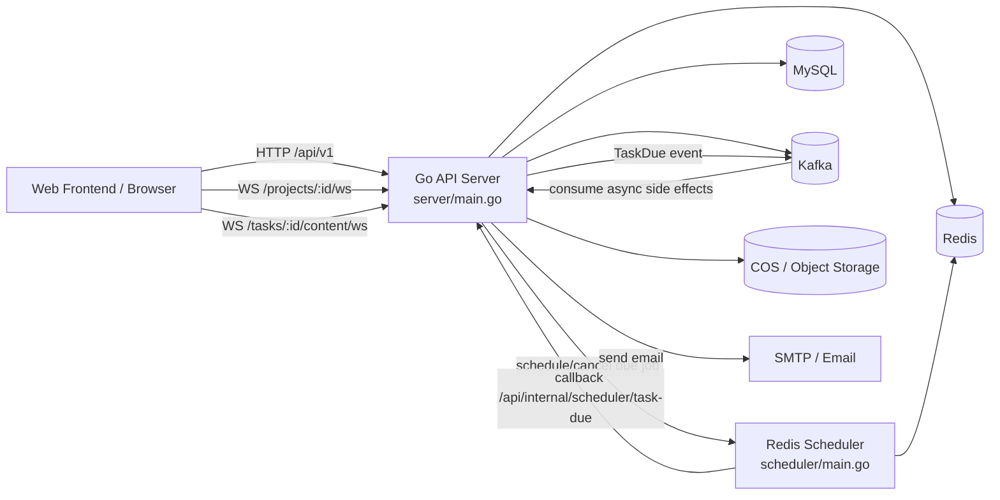

## 4. API Server 内部分层

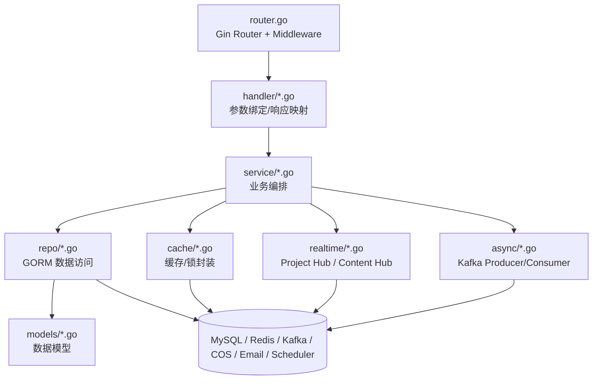

## 5. 启动装配流程

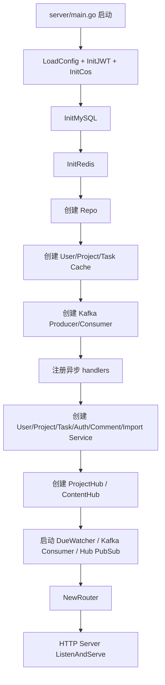

## 6. 核心模块职责

### 6.1 handler 层

- 只负责参数解析、上下文提取、错误映射、响应结构。
- 不承载核心业务规则。
- WebSocket handler 负责升级连接前的 token 校验和权限校验。

### 6.2 service 层

- 真正的业务中心。
- 负责权限判断、分布式锁、CAS 版本控制、缓存回填、事件记录、调度器调用、异步消息发布。
- 关键服务：
  - `UserService`
  - `ProjectService`
  - `TaskService`
  - `TaskCommentService`
  - `DocumentImportService`
  - `AuthService`

### 6.3 repo 层

- 直接访问 MySQL。
- 负责查询、分页、软删除、恢复、事件表和正文更新表读写。

### 6.4 cache 层

- 统一封装 Redis 缓存读写。
- 提供分布式锁 `DistributedLock`，内置 watchdog 自动续期。
- 为热点 cache miss 提供跨实例保护。

### 6.5 realtime 层

- `ProjectHub`：项目级任务事件、presence、metadata lock。
- `ContentHub`：正文协同 update 广播。
- 使用 Redis Pub/Sub 做多节点 fan-out。

### 6.6 async 层

- Kafka producer / consumer。
- 异步处理头像缓存、对象删除、token version 回填、项目摘要缓存回填、到期提醒邮件。

## 7. 权威数据与实时数据边界

| 类型 | 权威来源 | 实时传播方式 | 断线补偿 |
| --- | --- | --- | --- |
| 用户/空间/任务元数据 | MySQL | HTTP 写入后广播 Project WS | `GET /api/v1/projects/:id/sync` |
| 文档正文 | `task_content_updates` + `tasks.content_md` 快照 | Content WS + Redis Pub/Sub | Content WS 初始化时按游标补偿 |
| presence | 当前节点内存房间状态 | Project WS 周期快照 | 无持久化，靠后续快照覆盖 |
| metadata 锁 | Redis 分布式锁 | Project WS 广播 | 连接断开自动释放 |
| 到期提醒计划 | Redis Scheduler 队列 | Scheduler 回调 | 任务更新时重设/取消 |

## 8. 关键横切机制

### 8.1 鉴权

- 普通 HTTP 路由走 `AuthMiddleware`。
- WebSocket 走自鉴权，支持：
  - `Authorization: Bearer <token>`
  - `?token=<jwt>`
- `AuthService` 会校验：
  - JWT 是否过期/非法
  - `jti` 是否已进入黑名单
  - `token_version` 是否仍与服务端一致

### 8.2 限流

- 统一中间件：`RedisRateLimitMiddleware`
- Redis token bucket 为主，本地 limiter 为降级。
- 未登录入口按 `IP + method + route`。
- 已登录入口按 `uid + method + route`。

### 8.3 缓存击穿保护

- 先走进程内 `singleflight`
- 再走 Redis 分布式锁
- 未拿到锁的请求会短暂轮询缓存
- 超时后降级直接回源 DB

### 8.4 并发写保护

- 元数据写路径：分布式锁 + `expected_version` CAS
- 正文协同写路径：`message_id` 幂等去重 + update log 持久化

## 9. 功能流程图

以下按当前后端能力拆分。

### 9.1 用户注册

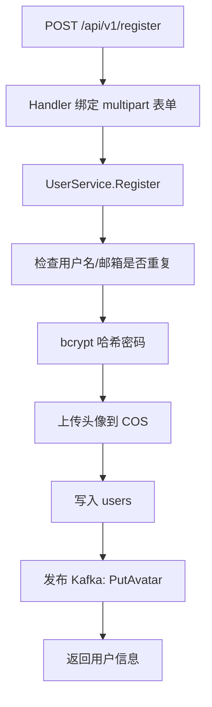

### 9.2 用户登录 / 鉴权

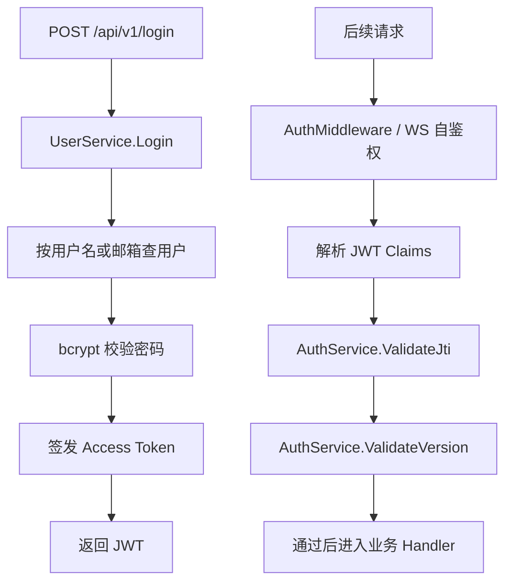

### 9.3 用户资料读取 / 更新

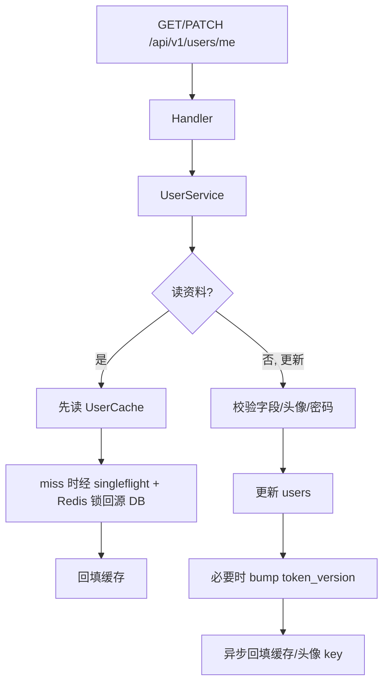

### 9.4 空间（Project/Space）创建

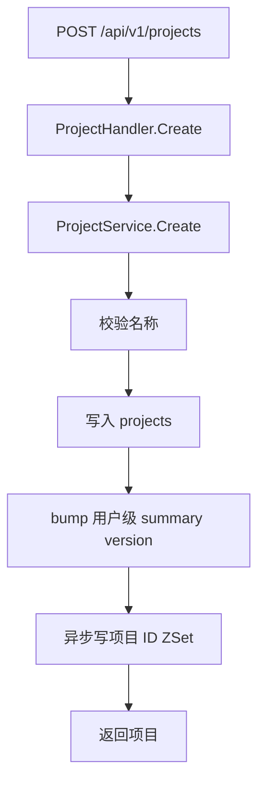

### 9.5 空间列表 / 搜索

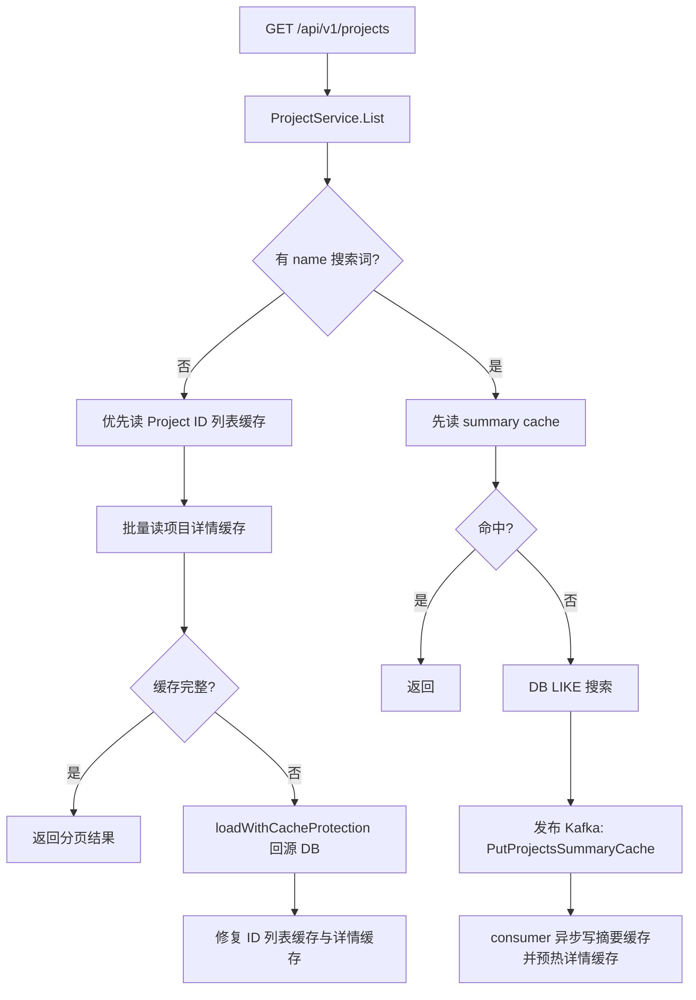

### 9.6 空间更新 / 删除 / 回收站恢复

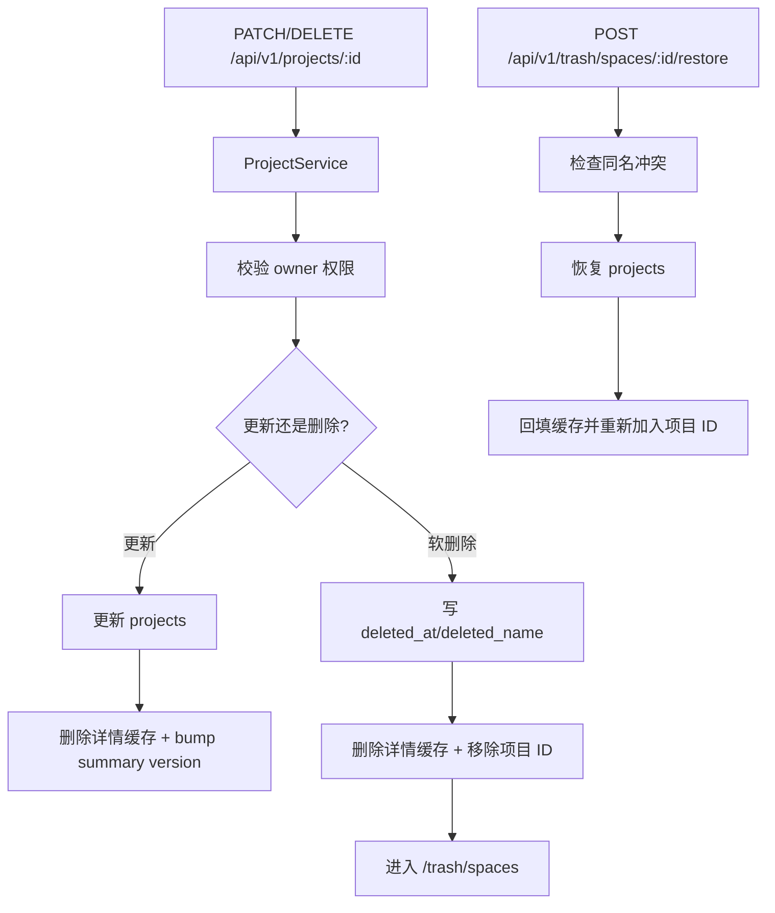

### 9.7 文档/任务创建

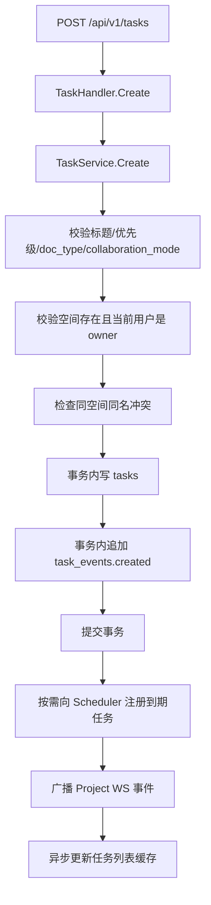

### 9.8 文档/任务元数据更新

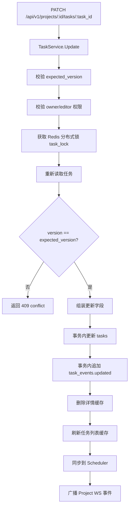

### 9.9 文档/任务删除与任务回收站

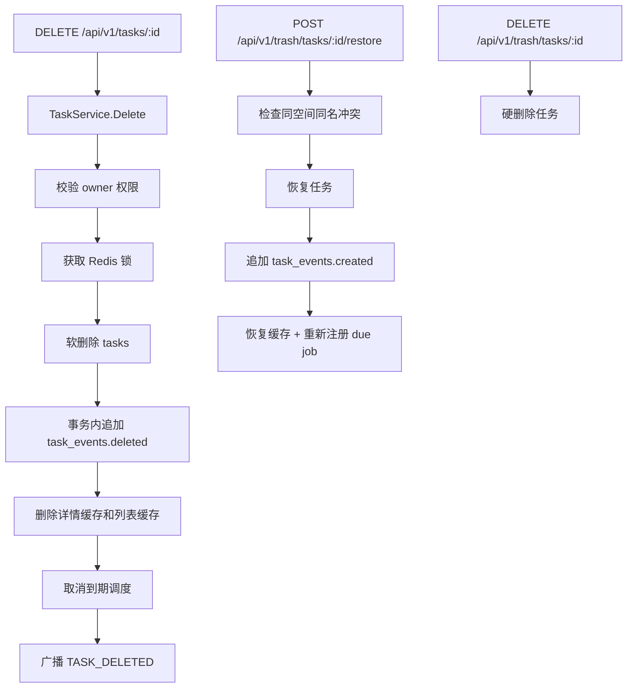

### 9.10 文档详情读取与成员权限

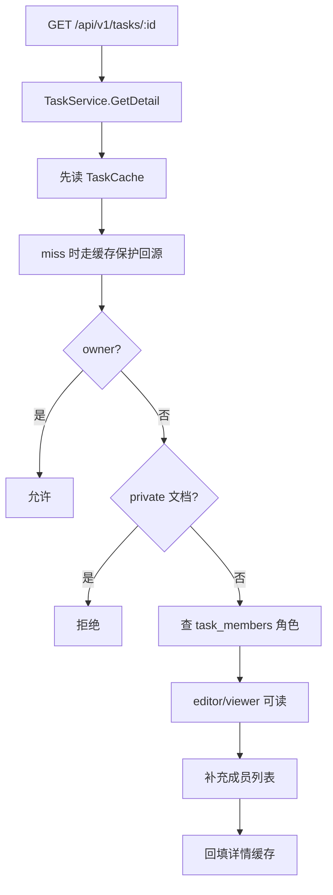

### 9.11 成员管理

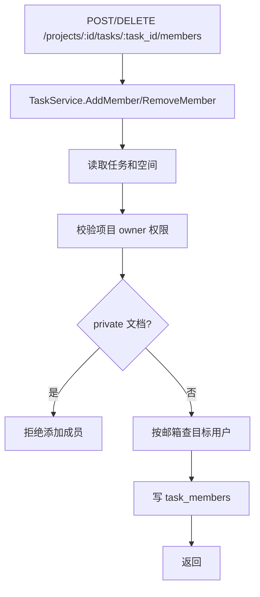

### 9.12 今日日记 / 指定日期日记

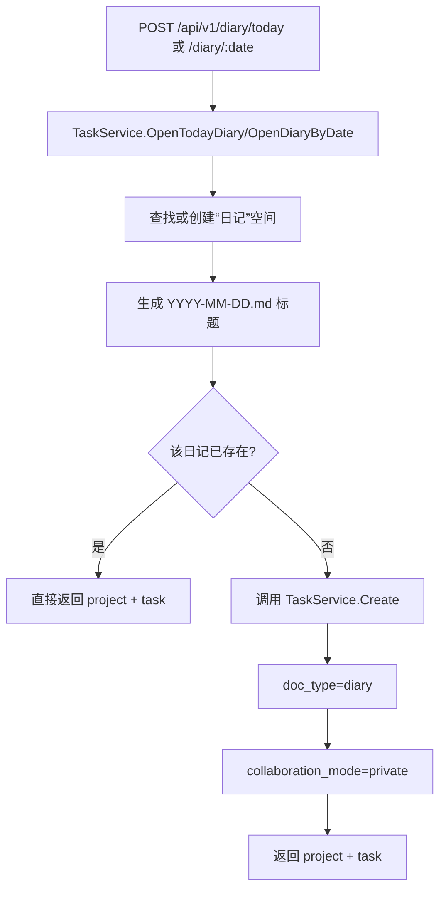

### 9.13 日记正文保存

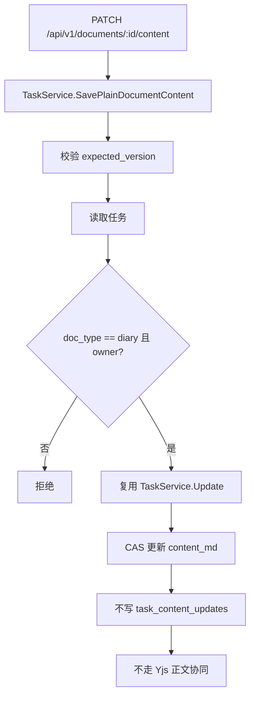

### 9.14 会议纪要创建

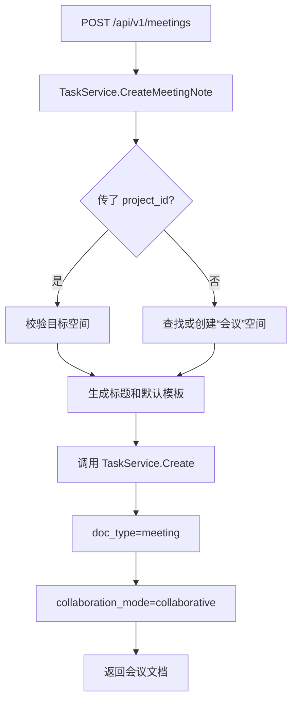

### 9.15 会议行动项转 Todo

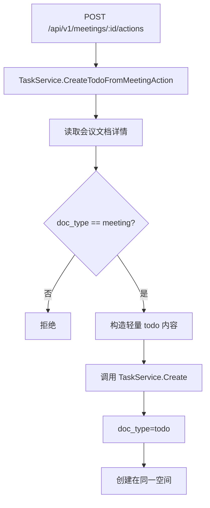

### 9.16 Markdown 导入

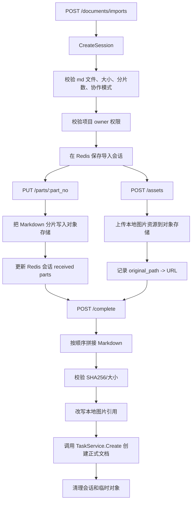

### 9.17 评论

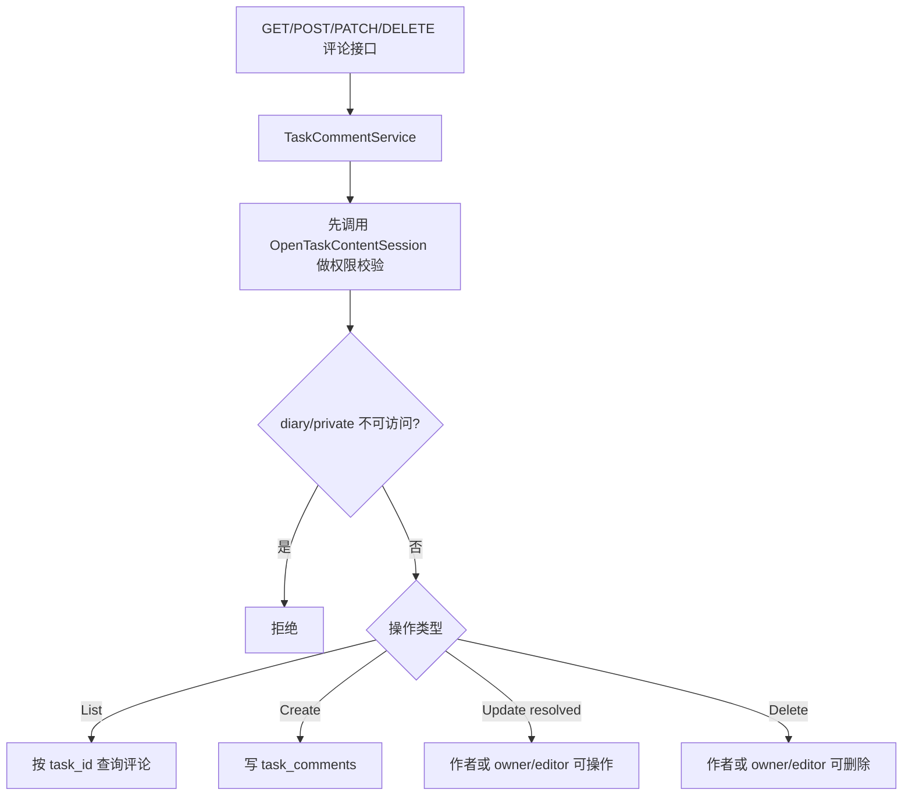

### 9.18 搜索

```mermaid
flowchart TD
    A[GET /api/v1/search?q=] --> B[TaskService.SearchWorkspace]
    B --> C[校验 query 长度 >= 2]
    C --> D[projectRepo.Search 搜空间]
    D --> E[taskRepo.SearchByUser 搜可访问文档/会议/todo]
    E --> F[聚合返回 spaces + documents]
```

### 9.19 项目活动流

```mermaid
flowchart TD
    A[GET /api/v1/projects/:id/activities] --> B[TaskService.ListProjectActivities]
    B --> C[校验项目访问权限]
    C --> D[按 task_events 倒序分页]
    D --> E[把 event payload 转成活动摘要]
    E --> F[返回 recent-first 活动列表]
```

### 9.20 项目 Sync API

```mermaid
flowchart TD
    A[GET /api/v1/projects/:id/sync] --> B[TaskService.SyncProjectEvents]
    B --> C[校验项目访问权限]
    C --> D[按 task_events.id > cursor 查询]
    D --> E[多取一条判断 has_more]
    E --> F[返回 events + next_cursor + has_more]
```

### 9.21 项目级 WebSocket：事件、在线态、锁

```mermaid
flowchart TD
    A[GET /api/v1/projects/:id/ws] --> B[ProjectWSHandler]
    B --> C[JWT 自鉴权]
    C --> D[OpenProjectRealtimeSession 校验项目权限]
    D --> E[Upgrade WebSocket]
    E --> F[ProjectHub 注册连接到 project room]
    F --> G[发送 PROJECT_INIT / 初始补偿]
    G --> H[连接进入读写循环]

    H --> I[任务 create/update/delete 提交成功]
    I --> J[写 task_events]
    J --> K[ProjectHub.BroadcastTaskEvent]
    K --> L[本节点广播]
    K --> M[Redis Pub/Sub 发布]
    M --> N[其他节点消费后本地广播]

    H --> O[定时/进出房间广播 PRESENCE_SNAPSHOT]
    H --> P[客户端发送 VIEW_DOCUMENT 更新 viewing_task_id]
    H --> Q[客户端发送 LOCK_REQUEST/LOCK_RELEASE]
    Q --> R[ProjectLockManager 基于 Redis 锁处理]
    R --> S[广播 TASK_LOCKED / TASK_UNLOCKED / LOCK_ERROR]
```

### 9.22 正文协同 WebSocket

```mermaid
flowchart TD
    A[GET /api/v1/tasks/:id/content/ws] --> B[ContentWSHandler]
    B --> C[JWT 自鉴权]
    C --> D[OpenTaskContentSession]
    D --> E{diary?}
    E -->|是| F[拒绝，提示走 plain Markdown API]
    E -->|否| G[Upgrade WebSocket]
    G --> H[ContentHub 注册到 task room]
    H --> I[按 last_update_id 发送 CONTENT_INIT]

    I --> J[客户端发送 CONTENT_UPDATE]
    J --> K[AppendTaskContentUpdate]
    K --> L[按 message_id 去重]
    L --> M[事务内写 task_content_updates]
    M --> N[可选刷新 tasks.content_md 快照]
    N --> O[本节点广播给其他连接]
    O --> P[Redis Pub/Sub fan-out 到其他节点]
    P --> Q[返回 CONTENT_ACK]
```

### 9.23 metadata 锁

```mermaid
flowchart TD
    A[客户端发送 LOCK_REQUEST] --> B[ProjectLockManager.Acquire]
    B --> C[lock key = collab:task:{taskID}:{field}]
    C --> D[Redis DistributedLock Acquire]
    D --> E{成功?}
    E -->|否| F[返回 LOCK_ERROR]
    E -->|是| G[在本机记录 held lock]
    G --> H[广播 TASK_LOCKED]

    I[客户端发送 LOCK_RELEASE 或连接断开] --> J[ProjectLockManager.Release/ReleaseClient]
    J --> K[Redis Release]
    K --> L[广播 TASK_UNLOCKED]
```

### 9.24 实时指标

```mermaid
flowchart TD
    A[GET /api/v1/realtime/metrics] --> B[RealtimeMetricsHandler]
    B --> C[读取 ProjectHub.MetricsSnapshot]
    C --> D[读取 ContentHub.MetricsSnapshot]
    D --> E[返回当前节点 room/connection/user/counter 快照]
```

### 9.25 到期提醒调度

```mermaid
flowchart TD
    A[任务创建或更新 due_at] --> B[TaskService.scheduleDueIfNeeded / syncDueSchedule]
    B --> C[HTTPDueScheduler.ScheduleTaskOnce]
    C --> D[调用 Scheduler /api/v1/jobs/once]
    D --> E[Scheduler 写 Redis KV + ZSet]

    E --> F[Scheduler 每秒扫描到期 job]
    F --> G[对单个 job 加 processing lock]
    G --> H[回调 API /api/internal/scheduler/task-due]
    H --> I[TaskService.HandleDueCallback]
    I --> J[检查任务是否仍未完成、未通知、确实到期]
    J --> K[更新 notified 状态]
    K --> L[发布 Kafka: TaskDue]
    L --> M[Kafka consumer 发送邮件]
```

### 9.26 Kafka 异步副作用

```mermaid
flowchart TD
    A[业务主链路] --> B[PublishWithTimeout]
    B --> C[Kafka Producer]
    C --> D[Kafka Topic]
    D --> E[Kafka Consumer]
    E --> F{topic}
    F -->|PutAvatar/UpdateAvatar| G[更新头像缓存]
    F -->|DeleteCOS| H[删除对象存储资源]
    F -->|PutVersion| I[回填 token_version 缓存]
    F -->|PutProjectsSummaryCache| J[写项目摘要缓存]
    F -->|TaskDue| K[发送到期提醒邮件]
    E --> L[失败重试]
    L --> M[仍失败则进 DLQ]
```

### 9.27 分布式限流

```mermaid
flowchart TD
    A[请求进入 Gin] --> B[RedisRateLimitMiddleware]
    B --> C[构造 key: uid/IP + method + route]
    C --> D[Redis Lua token bucket]
    D --> E{Redis 正常?}
    E -->|是| F{allowed?}
    E -->|否| G[降级到本地 limiter]
    G --> F
    F -->|否| H[返回 429]
    F -->|是| I[进入后续 handler]
```

### 9.28 缓存击穿保护

```mermaid
flowchart TD
    A[读取缓存 miss] --> B[loadWithCacheProtection]
    B --> C[singleflight 合并本进程并发]
    C --> D[尝试获取 Redis 分布式锁]
    D --> E{拿到锁?}
    E -->|是| F[回源 DB]
    F --> G[回填缓存]
    G --> H[释放锁]
    E -->|否| I[短暂轮询缓存等待别人回填]
    I --> J{等到缓存?}
    J -->|是| K[直接返回缓存]
    J -->|否| L[超时后自己回源，保证可用性]
```

## 10. 关键数据对象

| 对象 | 作用 |
| --- | --- |
| `users` | 用户、头像、token version |
| `projects` | 空间，含软删除字段 |
| `tasks` | 文档/会议/日记/todo 统一聚合根，含 `doc_type`、`collaboration_mode`、`version` |
| `task_members` | 协作文档成员与角色 |
| `task_events` | 项目级元数据事件日志，支撑 Sync API、活动流、Project WS 初始补偿 |
| `task_content_updates` | 正文增量日志，支撑 Content WS 初始化和正文同步 |
| `task_comments` | 文档级评论 |

## 11. 当前架构特点

- 优点
  - 分层边界清楚，handler 很薄，业务都收敛在 service。
  - 实时协同和权威写路径分离明确。
  - 多实例关键路径已补 Redis 锁、Pub/Sub、分布式限流。
  - 事件日志、活动流、断线补偿复用同一事实源，模型统一。
- 代价
  - `TaskService` 责任较重，是当前最大的业务聚合点。
  - 搜索仍是 DB LIKE，不是全文索引。
  - 实时指标只覆盖当前节点，不是全局聚合。
  - metadata 锁、presence 属于运行时状态，重连后依赖新快照恢复。

## 12. 推荐阅读顺序

如果后续继续维护后端，建议按这个顺序读代码：

1. `server/main.go`
2. `server/router.go`
3. `server/service/task_service.go`
4. `server/service/project_service.go`
5. `server/service/task_sync.go`
6. `server/service/task_content.go`
7. `server/realtime/hub.go`
8. `server/realtime/content_hub.go`
9. `server/service/document_import.go`
10. `server/service/due_scheduler.go`
11. `scheduler/main.go`
